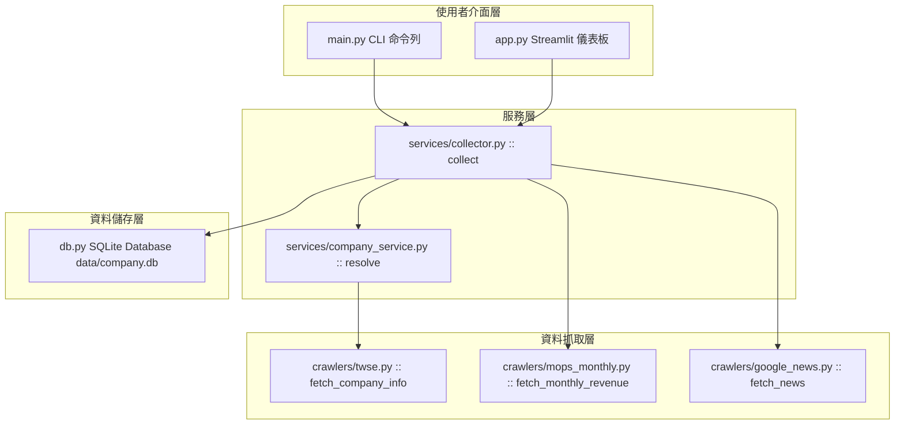

# Company Intelligence 台灣公司財務與新聞情報自動化系統

[](https://www.python.org/)
[](https://streamlit.io/)
[-green.svg)](https://www.sqlite.org/)
[](spec.md)

**Company Intelligence** 是一個專為台灣股市（上市 SII / 上櫃 OTC）公司設計的財務與新聞情報自動化收集、儲存與視覺化分析系統。

系統自動整合 **公開資訊觀測站（MOPS）歷史月營收**、**臺灣證券交易所 (TWSE) OpenAPI 公司資訊** 與 **Google News RSS 當月新聞**，並將結果存入本地 SQLite 資料庫（WAL 模式），同時提供強大的 **CLI 工具** 與 **Streamlit 視覺化儀表板**。

---

## 📸 核心功能與亮點 (Key Features)

- 🏢 **智能公司解析 (Company Resolver)**：
  - 輸入股票代號（如 `9904`）或公司名稱（如 `寶成` / `9904 寶成`），自動透過 TWSE OpenAPI 解析完整公司全名、簡稱與產業別。
- 📊 **MOPS 歷史月營收自動爬蟲**：
  - 自動抓取並解析 MOPS 歷史月營收 HTML 靜態報表。
  - 提取當月營收、去年同期營收、月增率/年增率 (YoY)、當月累計營收、去年累計營收、累計 YoY 與公司備註說明（單位：新台幣仟元）。
  - 支援 `market="auto"` 自動判定上市 (SII) 或上櫃 (OTC)。
- 📰 **Google News RSS 定向新聞檢索**：
  - 自動建立精準日期約束語法（`after:YYYY-MM-01 before:YYYY-MM-01`）與公司名稱關鍵字語法。
  - 抓取當月發布新聞之標題、來源媒體、發布時間與連結 URL，並支援自訂擴充關鍵字（如 `Nike|adidas|越南|印尼`）。
- 💾 **SQLite 冪等性持久化儲存**：
  - 採用 SQLite WAL (Write-Ahead Logging) 高效模式。
  - 設計 `companies`、`monthly_revenue` 與 `news` 資料表，具備 `ON CONFLICT DO UPDATE / IGNORE` 冪等寫入能力，重複執行不重覆洗洗資料。
- 🖥️ **雙端介面 (CLI & Streamlit Dashboard)**：
  - **CLI (main.py)**：適合自動化排程、腳本調用與批次抓取，輸出結構化 JSON。
  - **Streamlit (app.py)**：直覺美觀的 Web 互動儀表板，即時呈現關鍵指標、新聞表格與歷史 SQLite 資料庫紀錄。
- 🛡️ **獨立錯誤隔離 (Error Isolation)**：
  - 營收抓取與新聞抓取獨立執行，單一服務異常不影響其他模組運作，錯誤完整紀錄於回傳結果中。

---

## 🏗️ 系統架構與模組設計 (System Architecture)

本專案遵循 **規範驅動開發 (Spec-Driven Development, SDD)** 精神設計，模組劃分清晰且解耦：



### 📁 專案目錄結構

```text
company-intelligence/
├── README.md                   # 專案說明文件 (本文件)
├── spec.md                     # 系統規格書 (Spec-Driven Development)
├── plan.md                     # 開發與執行計畫 / Checklists
├── requirements.txt            # Python 套件依賴
├── config.example.json         # 設定檔範例
├── main.py                     # CLI 命令列入口點
├── app.py                      # Streamlit 視覺化 Web UI
├── company_intel/              # 核心套件模組
│   ├── __init__.py
│   ├── config.py               # 全域設定載入與維護
│   ├── db.py                   # SQLite Schema 初始化與 Upsert 操作
│   ├── crawlers/               # 資料爬蟲層
│   │   ├── twse.py             # TWSE OpenAPI 公司名稱解析
│   │   ├── mops_monthly.py     # MOPS 月營收 HTML 爬蟲
│   │   └── google_news.py      # Google News RSS 爬蟲
│   └── services/               # 業務邏輯服務層
│       ├── company_service.py  # 公司代號模糊比對與關鍵字組裝
│       └── collector.py        # 爬蟲與 DB 寫入的主流程協調器
├── tests/                      # 單元與整合測試
│   └── test_imports.py
└── data/                       # 本地資料庫儲存目錄 (自動建立)
    └── company.db              # SQLite 資料庫檔案 (WAL 模式)
```

---

## 🚀 快速開始 (Quick Start)

### 1. 環境需求與套件安裝

建議使用 Python 3.11 或 3.12。

#### 使用標準 venv (Windows PowerShell)

```powershell
# 複製專案與建立虛擬環境
python -m venv .venv
.\.venv\Scripts\Activate.ps1

# 安裝依賴套件
pip install -r requirements.txt

# 建立設定檔
copy config.example.json config.json
```

#### 使用 uv 包管理器

```powershell
uv venv
.\.venv\Scripts\Activate.ps1
uv pip install -r requirements.txt
copy config.example.json config.json
```

#### Linux / macOS

```bash
python3 -m venv .venv
source .venv/bin/activate
pip install -r requirements.txt
cp config.example.json config.json
```

---

## 💻 CLI 命令列介面指南 (CLI Usage)

`main.py` 提供極速 CLI 介面，結果以標準 JSON 格式輸出：

### 常用命令範例

1. **基本抓取（寶成 2026 年 7 月份營收 + 新聞）**：
   ```powershell
   python main.py --company "9904 寶成" --year 2026 --month 7
   ```

2. **僅抓取 Google News（跳過營收爬蟲）**：
   ```powershell
   python main.py --company "9904 寶成" --year 2026 --month 7 --no-revenue
   ```

3. **僅抓取月營收（跳過新聞爬蟲）**：
   ```powershell
   python main.py --company "9904 寶成" --year 2026 --month 7 --no-news
   ```

4. **加入自訂新聞關鍵字**（以 `|` 分隔）：
   ```powershell
   python main.py --company "9904 寶成" --year 2026 --month 7 --keywords "Nike|adidas|越南|印尼"
   ```

5. **指定市場類別 (sii 上市 / otc 上櫃)**：
   ```powershell
   python main.py --company "XXXX" --year 2026 --month 7 --market otc
   ```

### CLI 參數一覽表

| 參數 | 必填 | 預設值 | 說明 |
| :--- | :---: | :---: | :--- |
| `--company` | 是 | - | 公司股票代號或名稱（例如 `"9904"`、`"寶成"`、`"9904 寶成"`） |
| `--year` | 是 | - | 抓取年份 (西元年，例如 `2026`) |
| `--month` | 是 | - | 抓取月份 (`1` ~ `12`) |
| `--market` | 否 | `auto` | 市場類別：`auto` (自動比對), `sii` (上市), `otc` (上櫃) |
| `--keywords` | 否 | `""` | 額外 Google News 關鍵字，多個關鍵字以 `\|` 分隔 |
| `--db` | 否 | `data/company.db` | SQLite 資料庫儲存路徑 |
| `--no-revenue` | 否 | `False` | 標記此旗標則**不抓取**月營收 |
| `--no-news` | 否 | `False` | 標記此旗標則**不抓取** Google News |

---

## 🌐 Streamlit 視覺化儀表板 (Web Dashboard)

本專案內建 Streamlit 網頁應用程式，適合進行可視化數據分析：

```powershell
streamlit run app.py
```

執行後瀏覽器將自動開啟：
[http://localhost:8501](http://localhost:8501)

### 儀表板功能亮點：
1. **側邊欄條件設定**：支援動態選擇公司、年月、市場、額外新聞關鍵字與抓取切換。
2. **營收 KPI 卡片**：即時呈現「當月營收」、「YoY 年增率」、「累計營收」與「累計 YoY」，並附有 MOPS 公司備註警示。
3. **新聞列表 Dataframe**：以表格化呈現新聞日期、媒體來源、新聞標題與點擊直接跳轉的原生 URL 連結。
4. **歷史 SQLite 資料庫檢視器**：底層即時聯結 `data/company.db` 展示最近 100 筆已存檔之歷史月營收紀錄。

---

## ⚙️ 設定檔說明 (`config.json`)

系統會在啟動時載入 `config.json`（若不存在則降級使用預設值）：

```json
{
  "request_timeout": 20,
  "user_agent": "Mozilla/5.0 CompanyIntelligence/1.0",
  "google_news": {
    "language": "zh-TW",
    "country": "TW",
    "ceid": "TW:zh-Hant"
  }
}
```

- `request_timeout`：HTTP 請求逾時秒數（預設 20 秒）。
- `user_agent`：請求 MOPS / TWSE / Google News 時帶入之 User-Agent 標頭。
- `google_news`：RSS 搜尋之語系、國家與區域設定。

---

## 🗄️ 資料庫 Schema 與 SQL 查詢 (Database)

資料庫預設建立於 `data/company.db`，啟用 SQLite `WAL (Write-Ahead Logging)` 模式以提升併發讀寫效能。

### 1. `companies` (公司基本資料表)
| 欄位 | 型態 | 主鍵 | 說明 |
| :--- | :--- | :---: | :--- |
| `stock_id` | TEXT | PRIMARY KEY | 股票代號 (如 `"9904"`) |
| `company_name` | TEXT | NOT NULL | 公司全名 |
| `short_name` | TEXT | | 公司簡稱 |
| `market` | TEXT | | 市場類別 (`sii` / `otc`) |
| `industry` | TEXT | | 產業類別 (如 `"製鞋業"`) |
| `news_keywords` | TEXT | | 關聯搜尋關鍵字 (`\|` 分隔) |
| `updated_at` | TEXT | | 更新時間 |

### 2. `monthly_revenue` (歷史月營收資料表)
| 欄位 | 型態 | 主鍵 | 說明 |
| :--- | :--- | :---: | :--- |
| `stock_id` | TEXT | PK (1/3) | 股票代號 |
| `year` | INTEGER | PK (2/3) | 西元年份 (如 `2026`) |
| `month` | INTEGER | PK (3/3) | 月份 (`1`~`12`) |
| `company_name` | TEXT | | 抓取當時之公司名稱 |
| `revenue` | REAL | | 當月營收（仟元） |
| `revenue_last_year` | REAL | | 去年同期營收（仟元） |
| `yoy` | REAL | | 營收年增率 (%) |
| `accumulated_revenue` | REAL | | 累計營收（仟元） |
| `accumulated_last_year` | REAL | | 去年累計營收（仟元） |
| `accumulated_yoy` | REAL | | 累計年增率 (%) |
| `note` | TEXT | | 公司備註說明 |
| `source_url` | TEXT | | MOPS 來源頁面網址 |
| `fetched_at` | TEXT | | 抓取時間 |

### 3. `news` (當月新聞索引表)
| 欄位 | 型態 | 主鍵/約束 | 說明 |
| :--- | :--- | :---: | :--- |
| `id` | INTEGER | PK AUTO | 系統自增主鍵 |
| `stock_id` | TEXT | NOT NULL | 股票代號 |
| `title` | TEXT | NOT NULL | 新聞標題 |
| `publish_date` | TEXT | | 新聞發布時間 |
| `source` | TEXT | | 新聞來源媒體 |
| `url` | TEXT | UNIQUE(stock_id, url) | 新聞原生網址 (用於去重) |
| `query` | TEXT | | 爬取時使用的 Search Query |
| `fetched_at` | TEXT | | 抓取時間 |

### 常用 SQLite 查詢範例

查詢寶成 (9904) 的歷史營收趨勢：

```sql
SELECT year, month, revenue, yoy, accumulated_yoy
FROM monthly_revenue
WHERE stock_id = '9904'
ORDER BY year DESC, month DESC;
```

查詢寶成最新抓取的新聞條目：

```sql
SELECT publish_date, source, title, url
FROM news
WHERE stock_id = '9904'
ORDER BY publish_date DESC
LIMIT 20;
```

---

## 🧪 自動化測試 (Testing)

本專案使用 `pytest` 進行單元與整合測試：

```powershell
pytest -v tests/
```

---

## 🛡️ 資料來源策略與禮儀 (Data Strategy & Ethics)

1. **臺灣證券交易所 (TWSE) OpenAPI**：
   - 使用公開 openapi `t187ap03_L` 解析公司基礎對照資料。
2. **公開資訊觀測站 (MOPS)**：
   - 解析 MOPS 歷史 HTML 靜態月營收報表 (`t21sc03_{民國年}_{月}.html`)。
   - 爬蟲模組已進行解耦封裝（`company_intel/crawlers/mops_monthly.py`），若 MOPS 改版僅需替換單一檔案。
   - 請遵循網路爬蟲規範，控制請求頻率。
3. **Google News RSS**：
   - 透過 RSS 介面抓取新聞索引，非爬取各新聞媒體全文。

---

## 🗺️ 未來擴充藍圖 (Roadmap)

詳細規格請參閱 [`spec.md`](spec.md) 與開發進度 [`plan.md`](plan.md)。

- [x] **Phase 1 (MVP 現狀)**：MOPS 月營收爬蟲 + Google News RSS + SQLite WAL + CLI & Streamlit 雙介面。
- [ ] **Phase 2 (MOPS 季財報 & 重大訊息)**：新增綜合損益表、資產負債表與重大訊息即時監控。
- [ ] **Phase 3 (AI 新聞去重與情緒摘要)**：導入 Gemini API 進行新聞標題去重、利多/利空情緒評分與重點摘要。
- [ ] **Phase 4 ( Streamlit 高級圖表)**：多公司同期 YoY 雙軸對比圖表與產業趨勢走勢圖。
- [ ] **Phase 5 (FastAPI & MCP Server 介面)**：提供 RESTful API 及 Model Context Protocol (MCP) 介面供 AI Agent 直接調用。
- [ ] **Phase 6 (Hermes Agent 自動監控)**：排程監控每月營收發布（每月 1-10 日），主動觸發抓取與推播通知。

---

## 📄 授權條款 (License)

本專案採用 [MIT License](LICENSE) 授權。
