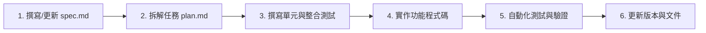

# Company Intelligence 開發與執行計畫 (plan.md)

> **版本**：1.15.0 (v15)  
> **開發模式**：Spec-Driven Development (SDD)  
> **狀態**：In Progress (v1 - v15 已完成)  

---

## 1. 開發策略與 SDD 工作流程 (Strategy & SDD Workflow)

本專案採用 **規範驅動開發 (Spec-Driven Development, SDD)** 模式：



1. **規格先行 (Spec First)**：任何新功能必須先更新 `spec.md` 確定資料模型與 API 介面。
2. **計畫拆解 (Plan & Breakdown)**：在 `plan.md` 建立具體步驟與 Checkbox。
3. **測試與實作 (TDD / Verify)**：補齊單元測試（使用 mock 隔離外部 HTTP 請求），確認功能綠燈後發布。

---

## 2. 里程碑與階段規劃 (Milestones & Roadmap)

| 階段 / 版本 | 里程碑名稱 | 主要交付物 | 狀態 |
| :--- | :--- | :--- | :---: |
| **Phase 1 (v1-v6)** | MVP 基礎建設與月營收 + 新聞 | CLI 工具、SQLite WAL DB、MOPS POST 爬蟲、TWSE OpenAPI、Google News RSS、Streamlit 儀表板 | `[x]` 已完成 |
| **v7** | 完整歷史月營收改用 FinMind | FinMind API 整合 (2002 至今歷史月營收)、當月/上月/YoY/累計營收自動計算 | `[x]` 已完成 |
| **v8** | 統一幣別與金額單位 | DB 統一儲存報告幣別「元」、`schema_migrations` 自動轉檔舊資料 (千元→元) | `[x]` 已完成 |
| **v9-v10** | 雙 Tab 分頁與顯示單位切換 | 📊 查詢結果與 🗄️ 歷史資料庫分頁、顯示單位切換（元/千元/百萬元/億元） | `[x]` 已完成 |
| **v11-v12** | Canonical Symbol 與國際公司 | 支援 `9904.TW`, `1836.HK`, `300979.SZ`, `3813.HK`, `0551.HK` 跨市場 Symbol 與多幣別 | `[x]` 已完成 |
| **v13** | 下拉清單持久化與同年月跨公司比對 | `data/company_options.json` 選單與動態新增、`所有公司+同年月` 篩選、新聞降噪 | `[x]` 已完成 |
| **v14-v15** | Playwright Web 瀏覽器與 DIV/grid 解析 | Playwright Chromium 自動化爬取裕元 IR DIV/grid 畫面、新聞雙層 Hard Filter | `[x]` 已完成 |
| **Phase 2** | 季財報深度與重大訊息監測 | AKShare/Eastmoney (華利)、Yahoo Finance (港股) 財報整合；重大訊息監控 | `[!]` 部分完成 (財報已整合) |
| **Phase 3** | AI 新聞去重與情緒摘要 | Gemini LLM 整合、新聞摘要、利多利空分數標記 | `[ ]` 規劃中 |
| **Phase 4** | Streamlit 高級圖表與對比 | 多公司同期 YoY 對比圖表、營收歷史走勢分析圖 (Plotly/Altair) | `[ ]` 規劃中 |
| **Phase 5** | FastAPI 與 MCP Server 介面 | RESTful API 服務、Model Context Protocol (MCP) Server 供 AI Agent 呼叫 | `[ ]` 規劃中 |
| **Phase 6** | Hermes Agent 自動監控 | 建立定時任務、自動觸發月營收抓取與主動通知機制 | `[ ]` 規劃中 |

---

## 3. 詳細任務拆解清單 (Detailed Task Breakdown)

### 已經完成項目 (v1 - v15)
- [x] **系統基礎架構與核心模組建置 (v1-v6)**
  - [x] 建立 `company_intel/config.py` 設定模組
  - [x] 建立 `company_intel/db.py` 初始化 SQLite (companies, monthly_revenue, news, financial_reports, schema_migrations)
  - [x] 實作 `crawlers/twse.py` 整合 TWSE OpenAPI 解析公司名稱與最新營收
  - [x] 實作 `crawlers/mops_monthly.py` MOPS POST 歷史月營收查詢
  - [x] 實作 `crawlers/google_news.py` 解析 Google News RSS XML 並結合日期與關鍵字
  - [x] 實作 `services/collector.py` 整合調用與錯誤處置
  - [x] 實作 `main.py` CLI 與 `app.py` Streamlit UI
- [x] **FinMind 歷史營收與單位正規化 (v7-v8)**
  - [x] 實作 `crawlers/finmind.py` 全量抓取台灣歷史月營收並補全 MoM/YoY/累計值
  - [x] 實作 DB Migration 機制，將舊有千元資料統一乘 1000 存入 TWD 元
- [x] **Streamlit UI 進階功能 (v9-v10)**
  - [x] 設計 📊 查詢結果 與 🗄️ 歷史資料庫 雙 Tab 介面
  - [x] 實作畫面顯示單位切換器（元、千元、百萬元、億元）
- [x] **國際公司與 Canonical Symbol (v11-v13)**
  - [x] 實作 `company_registry.py` 支援 `.TW`, `.HK`, `.SZ` Canonical Symbol 識別
  - [x] 實作 華利集團 (`300979.SZ`)、寶勝國際 (`3813.HK`)、九興 (`1836.HK`)、裕元 (`0551.HK`) 專屬路由
  - [x] 實作 `data/company_options.json` 選單載入與動態新增持久化
  - [x] 實作歷史資料「所有公司 + 同年月」跨公司同期比對功能
- [x] **Playwright 瀏覽器渲染與新聞降噪 (v14-v15)**
  - [x] 實作 `crawlers/yueyuen_official.py` 透過 Playwright Chromium 載入裕元 IR 動態 DIV/grid DOM 並解析月營收
  - [x] 實作 Google News 雙層硬過濾器 (排除酒店/餐飲/龍蝦/合唱等無關報導)

---

### 下一階段任務 (Phase 2 ~ Phase 6)

### Phase 2: 季財報深度與重大訊息擴充
- [x] **國際公司季報與財務指標**
  - [x] 新增 `crawlers/huali.py` 抓取華利集團 (300979.SZ) 三大財報
  - [x] 新增 `crawlers/yfinance_financial.py` 抓取港股財報 Fallback
- [ ] **MOPS 台股季報與重大訊息**
  - [ ] 實作 MOPS 綜合損益表、資產負債表、現金流量表爬蟲
  - [ ] 新增重大訊息 (Material Info) 爬蟲與 DB 表

### Phase 3: AI 新聞去重與情緒摘要 (LLM Integration)
- [ ] **規格制定 (`spec.md`)**
  - [ ] 定義 Gemini API Prompt 規格與 Structured Output Schema (JSON)
- [ ] **AI 服務模組**
  - [ ] 新增 `company_intel/services/ai_summary.py`
  - [ ] 實作新聞去重與聚合演算法 (Similarity Clustering)
  - [ ] 實作新聞總結與情緒評分 (-1.0 至 +1.0)
- [ ] **UI 擴充**
  - [ ] Streamlit 新增 AI Summary 卡片與重點新聞摘要列

### Phase 4: 多公司對比與高級圖表 (Multi-Company Comparison)
- [ ] **圖表模組建置**
  - [ ] 導入 Plotly / Altair 進行營收與 YoY 雙軸圖表繪製
  - [ ] 提供同產業多公司 (例如 寶成 vs 豐泰 vs 裕元) 營收成長率對比分頁

### Phase 5: FastAPI REST API & MCP Server 介面
- [ ] **FastAPI 封裝**
  - [ ] 新增 `server.py` 提供 `/api/v1/company/{id}/revenue` 與 `/api/v1/company/{id}/news`
- [ ] **MCP Server 支援**
  - [ ] 新增 `mcp_server.py` 實作 Context Protocol，讓 AI 代理（如 Antigravity / Claude）直接調用抓取工具

### Phase 6: Hermes Agent 自動監控與通知 (Automation & Supervision)
- [ ] **自動排程監控**
  - [ ] 建立每月中旬自動比對並發起全台關鍵上市櫃公司月營收抓取腳本
  - [ ] 整合 LINE Notification / Telegram Bot 推播營收創新高或異常警告

---

## 4. 測試與品質控制 (QA & Testing Strategy)

### 4.1 自動化測試執行
使用 `pytest` 執行所有單元測試與整合測試：

```powershell
pytest -v tests/
```

### 4.2 程式碼風格與 Static Analysis
使用 `ruff` 或 `flake8` 確保程式碼規範：

```powershell
ruff check company_intel/
```

---

## 5. 風控與反爬蟲應對策略 (Risk & Anti-Blocking Strategy)

1. **Playwright 瀏覽器渲染**：針對 JavaScript / AJAX 動態載入頁面（如裕元 IR），使用真實 Chromium 引擎處理。
2. **User-Agent 隨機化 / 擬真**：在 `Settings` 中配置常見瀏覽器 User-Agent 標頭。
3. **自動 Delay**：大量連線請求時自動加上 `time.sleep(1.0 + random.random())`。
4. **離線與 快取機制 (Caching)**：對於已抓取過的月營收數據，直接讀取本地 SQLite 避免重複對外請求。

