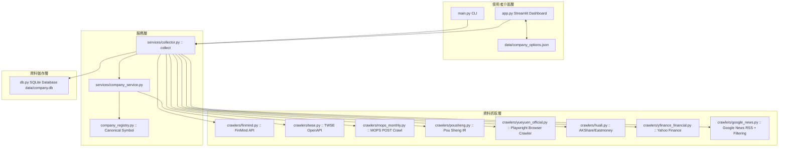

# Company Intelligence 系統規格書 (spec.md)

> **版本**：1.15.0 (v15)  
> **開發模式**：Spec-Driven Development (SDD)  
> **狀態**：Active  

---

## 1. 專案概觀 (System Overview & Vision)

`Company Intelligence` 是一個跨市場（台股 SII/OTC、港股 HKEX、陸股 SZSE）鞋業與體育用品公司之財務與新聞情報自動化收集與分析系統。

### 1.1 核心目標
1. **多來源自動化資料收集**：整合 FinMind API、TWSE OpenAPI、MOPS 歷史 POST 查詢、Playwright 自動化瀏覽器（裕元 IR）、Pou Sheng 官方 IR、AKShare/Eastmoney、Yahoo Finance 與 Google News RSS。
2. **統一貨幣與單位規格**：本地 SQLite DB 統一儲存公司報告幣別之「元」（TWD、CNY、USD），搭配自動化 Schema Migration。
3. **Canonical Symbol 識別**：採用標準化 Symbol (如 `9904.TW`、`1836.HK`、`300979.SZ`、`3813.HK`、`0551.HK`) 進行跨市場公司統一識別與路由。
4. **靈活雙介面與持久化設定**：提供 CLI 命令與 Streamlit 雙 Tab 儀表板，支援動態顯示單位切換（元/千元/百萬元/億元）與下拉選單持久化 (`data/company_options.json`)。
5. **規範驅動開發 (SDD)**：以明確的介面合約、資料模型與模組劃分，確保系統具備良好可維護性與未來擴充性。

---

## 2. 系統架構與模組設計 (System Architecture)

### 2.1 系統架構圖 (Mermaid Diagram)

### 2.2 模組劃分與職責

| 模組路徑 | 主要類別 / 函式 | 模組職責描述 |
| :--- | :--- | :--- |
| `company_intel/config.py` | `Settings`, `load_settings` | 載入並維護全域設定（預設 Timeout, User-Agent, DB 路徑等） |
| `company_intel/company_registry.py` | `INTERNATIONAL_COMPANIES`, `resolve_international` | 維護國際公司定義與 Canonical Symbol (`9904.TW`, `1836.HK`, `300979.SZ`, `3813.HK`, `0551.HK`) |
| `company_intel/db.py` | `connect`, `upsert_*`, migration | 初始化 SQLite DB (WAL Mode)，維護表結構變更與單位正規化 Migration |
| `company_intel/crawlers/finmind.py` | `fetch_finmind_monthly_revenue` | 抓取台灣股票 2002 至今之歷史月營收並計算 MoM / YoY / 累計值 |
| `company_intel/crawlers/twse.py` | `fetch_company_info`, `fetch_twse_latest_revenue` | 透過 TWSE OpenAPI 解析上市/上櫃公司代號與當月最新營收 |
| `company_intel/crawlers/mops_monthly.py` | `fetch_mops_monthly_revenue` | 以 POST 方式查詢 MOPS 歷史月營收單一公司頁面 (Fallback 來源) |
| `company_intel/crawlers/pousheng.py` | `fetch_pousheng_monthly_revenue` | 解析寶勝國際 (3813.HK) 官方 IR 月收益公告 |
| `company_intel/crawlers/yueyuen_official.py` | `fetch_yueyuen_official_revenue` | 使用 Playwright Chromium 渲染載入裕元工業 (0551.HK) 官網 DIV/grid 數據 |
| `company_intel/crawlers/huali.py` | `fetch_huali_financials` | 透過 AKShare / Eastmoney 抓取華利集團 (300979.SZ) 三大財務報表 |
| `company_intel/crawlers/yfinance_financial.py` | `fetch_yfinance_financials` | 使用 Yahoo Finance 抓取港股/國際公司財務報表 Fallback |
| `company_intel/crawlers/google_news.py` | `fetch_news` | 建立 Google News RSS Query，結合雙層降噪（Query Exclusion + Title Filter） |
| `company_intel/services/company_service.py` | `resolve_company` | 解析名稱/代號/Symbol，自動對接台灣公司與國際公司 Registry |
| `company_intel/services/collector.py` | `collect` | 協調公司解析、營收/財報路由、新聞抓取與 DB 寫入 |

---

## 3. 功能規格 (Functional Specifications)

### 3.1 Canonical Symbol 與公司路由規格
- **支援主要公司**：
  - 寶成 (`9904.TW`)：台灣上市 / TWD
  - 九興 (`1836.HK`)：港股 / USD
  - 華利集團 (`300979.SZ`)：深交所 / CNY
  - 寶勝 (`3813.HK`)：港股 / CNY
  - 裕元 (`0551.HK`)：港股 / USD
- **資料路由優先順序**：
  - 台灣公司 (`.TW`)：FinMind 歷史月營收 -> TWSE OpenAPI 最新快照 -> MOPS POST Fallback
  - 寶勝 (`3813.HK`)：Pou Sheng 官方 IR 月收益 -> Yahoo Finance
  - 裕元 (`0551.HK`)：Yue Yuen 官方 IR (Playwright 渲染 DIV/grid 解析) -> HKEX Fallback -> Yahoo Finance
  - 華利 (`300979.SZ`)：AKShare / Eastmoney 財報 -> Yahoo Finance Fallback
  - 所有公司：Google News RSS (發布日期排序 + 關鍵字排除與過濾)

### 3.2 數據金額單位規範 (Unit Normalization)
- **資料庫保存標準**：所有 `monthly_revenue` 與 `financial_reports` 之金額欄位統一儲存為**「原始報告幣別之元」**（如 TWD 元、CNY 元、USD 元）。
- **自動 Migration (`schema_migrations`)**：舊版以「千元」儲存之 MOPS/TWSE 資料，系統啟動時透過 `20260824_normalize_monthly_revenue_to_twd_v1` 自動乘 1000 正規化。
- **Streamlit 視覺化換算**：UI 提供「元 / 千元 (預設) / 百萬元 / 億元」動態換算，僅用於前端顯示，不改變 DB 底層資料。

### 3.3 Google News 降噪與日期卡控
- **日期範圍**：預設保留所選年月往前延伸 3 個月（例如選 2026/07，範圍為 2026/05/01 ~ 2026/07/31）。
- **裕元/寶成降噪**：Query 與 Python 端自動排除無關新聞（如「裕元花園酒店」、「餐廳」、「龍蝦」、「下午茶」、「粽」、「合唱」等）。
- **排序**：預設依 `publish_date` 由新到舊排序，UI 提供「最新 → 最舊」與「最舊 → 最新」切換。

### 3.4 資料庫與 Data Contracts

#### Schema 1: `companies` 表格
| 欄位名稱 | 型態 | 主鍵/約束 | 說明 |
| :--- | :--- | :--- | :--- |
| `stock_id` | TEXT | PRIMARY KEY | 股票代號 (例如 "9904", "0551") |
| `symbol` | TEXT | | Standard Canonical Symbol (例如 "9904.TW", "0551.HK") |
| `company_name` | TEXT | NOT NULL | 公司全名 |
| `short_name` | TEXT | | 公司簡稱 |
| `market` | TEXT | | 市場類別 (TW, HK, CN-SZ) |
| `industry` | TEXT | | 產業別 |
| `news_keywords` | TEXT | | 關聯搜尋關鍵字 (| 分隔) |
| `updated_at` | TEXT | DEFAULT CURRENT_TIMESTAMP | 更新時間 |

#### Schema 2: `monthly_revenue` 表格
| 欄位名稱 | 型態 | 主鍵/約束 | 說明 |
| :--- | :--- | :--- | :--- |
| `stock_id` | TEXT | PRIMARY KEY (1/3) | 股票代號 |
| `symbol` | TEXT | | Canonical Symbol |
| `year` | INTEGER | PRIMARY KEY (2/3) | 西元年份 (例如 2026) |
| `month` | INTEGER | PRIMARY KEY (3/3) | 月份 (1~12) |
| `company_name` | TEXT | | 抓取當時之公司名稱 |
| `revenue` | REAL | | 當月營收（「元」） |
| `previous_month_revenue`| REAL | | 上月營收（「元」） |
| `revenue_last_year` | REAL | | 去年同期營收（「元」） |
| `mom` | REAL | | 月增率 (%) |
| `yoy` | REAL | | 年增率 (%) |
| `accumulated_revenue` | REAL | | 累計營收（「元」） |
| `accumulated_last_year` | REAL | | 去年累計營收（「元」） |
| `accumulated_yoy` | REAL | | 累計年增率 (%) |
| `currency` | TEXT | | 貨幣 (TWD, CNY, USD) |
| `amount_unit` | TEXT | | 金額單位 (TWD, CNY, USD) |
| `source_type` | TEXT | | 資料來源標記 (finmind_historical, twse_openapi, mops, pousheng_ir, yueyuen_official 等) |
| `note` | TEXT | | 備註說明 |
| `source_url` | TEXT | | 資料來源網址 |
| `fetched_at` | TEXT | DEFAULT CURRENT_TIMESTAMP | 抓取時間 |

#### Schema 3: `financial_reports` 表格
| 欄位名稱 | 型態 | 主鍵/約束 | 說明 |
| :--- | :--- | :--- | :--- |
| `stock_id` | TEXT | PRIMARY KEY (1/2) | 股票代號 |
| `period_end` | TEXT | PRIMARY KEY (2/2) | 報告期結束日 (例如 "2026-06-30") |
| `symbol` | TEXT | | Canonical Symbol |
| `company_name` | TEXT | | 公司名稱 |
| `year` | INTEGER | | 西元年份 |
| `period_type` | TEXT | | 報告類型 (Q1, H1, Q3, FY) |
| `currency` | TEXT | | 貨幣 |
| `revenue` | REAL | | 營業收入 |
| `operating_profit` | REAL | | 營業利潤 |
| `net_profit` | REAL | | 淨利潤 |
| `eps` | REAL | | 每股盈餘 |
| `total_assets` | REAL | | 總資產 |
| `total_liabilities` | REAL | | 總負債 |
| `equity` | REAL | | 股東權益 |
| `operating_cashflow` | REAL | | 營業現金流 |
| `source_type` | TEXT | | 來源類型 (huali_akshare, yfinance) |
| `source_url` | TEXT | | 來源網址 |
| `fetched_at` | TEXT | DEFAULT CURRENT_TIMESTAMP | 抓取時間 |

#### Schema 4: `news` 表格
| 欄位名稱 | 型態 | 主鍵/約束 | 說明 |
| :--- | :--- | :--- | :--- |
| `id` | INTEGER | PRIMARY KEY AUTOINCREMENT | 自增主鍵 |
| `stock_id` | TEXT | NOT NULL | 股票代號 |
| `title` | TEXT | NOT NULL | 新聞標題 |
| `publish_date` | TEXT | | 發布時間 |
| `source` | TEXT | | 新聞來源媒體 |
| `url` | TEXT | UNIQUE(stock_id, url) | 新聞連結 (用於去重) |
| `query` | TEXT | | 爬取時使用的 Query |
| `fetched_at` | TEXT | DEFAULT CURRENT_TIMESTAMP | 抓取時間 |

#### Schema 5: `schema_migrations` 表格
| 欄位名稱 | 型態 | 主鍵/約束 | 說明 |
| :--- | :--- | :--- | :--- |
| `migration_id` | TEXT | PRIMARY KEY | Migration 唯一識別碼 |
| `applied_at` | TEXT | DEFAULT CURRENT_TIMESTAMP | 執行時間 |

---

## 4. UI 介面與功能規格 (Streamlit Dashboard)

1. **分頁結構 (Tabs)**：
   - 📊 **查詢結果 Tab**：顯示當次查詢之月營收指標 (Metric Card)、MoM/YoY、累計營收、財務簡報與 Google News 列表。
   - 🗄️ **歷史資料庫 Tab**：提供四種篩選條件獨立查詢：
     - `同公司 + 同年月`
     - `同公司 + 同年度`
     - `同公司全部`
     - `所有公司 + 同年月`（跨公司同年月橫向比對）
2. **選單與動態新增 (`data/company_options.json`)**：
   - 預設包含主要寶成、九興、華利、寶勝、裕元、豐泰、鈺齊、中傑、志強、來億等公司選項。
   - 提供「＋ 新增公司到選項清單」，輸入後自動持久化儲存至 JSON。
3. **顯示單位選擇器**：
   - 支援「元」、「千元（預設）」、「百萬元」、「億元」實時換算呈現。

