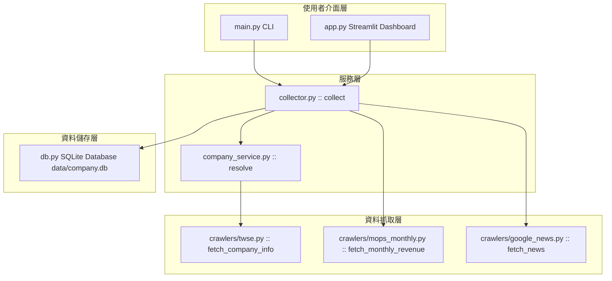

# Company Intelligence 系統規格書 (spec.md)

> **版本**：1.0.0  
> **開發模式**：Spec-Driven Development (SDD)  
> **狀態**：Active  

---

## 1. 專案概觀 (System Overview & Vision)

`Company Intelligence` 是一個專為台灣股市（上市 SII / 上櫃 OTC）公司設計的財務與新聞情報自動化收集與分析系統。

### 1.1 核心目標
1. **自動化資料收集**：整合公開資訊觀測站（MOPS）、臺灣證券交易所 (TWSE) OpenAPI 與 Google News RSS。
2. **結構化資料儲存**：建立 SQLite 本地資料庫，維護歷史月營收與新聞索引紀錄。
3. **靈活雙介面**：提供自動化 CLI 命令與視覺化 Streamlit 儀表板。
4. **規範驅動開發 (SDD)**：以明確的介面合約、資料模型與模組劃分，確保系統具備良好可維護性與未來擴充性。

---

## 2. 系統架構與模組設計 (System Architecture)

### 2.1 系統架構圖 (Mermaid Diagram)



### 2.2 模組劃分與職責

| 模組路徑 | 主要類別 / 函式 | 模組職責描述 |
| :--- | :--- | :--- |
| `company_intel/config.py` | `Settings`, `load_settings` | 載入並維護全域設定（預設 Timeout, User-Agent, DB 路徑等） |
| `company_intel/db.py` | `connect`, `upsert_*` | 初始化 SQLite DB Schema (WAL Mode)，提供冪等（Upsert）寫入操作 |
| `company_intel/crawlers/twse.py` | `fetch_company_info` | 透過 TWSE OpenAPI 解析上市/上櫃公司代號、全名與簡稱 |
| `company_intel/crawlers/mops_monthly.py` | `fetch_monthly_revenue` | 解析 MOPS 歷史靜態月營收 HTML 頁面並提取營收數據與 YoY |
| `company_intel/crawlers/google_news.py` | `fetch_news`, `build_query` | 組立日期範圍與關鍵字之 Google News RSS URL 並解析 XML 條目 |
| `company_intel/services/company_service.py` | `resolve`, `make_news_keywords` | 模糊輸入解析（代號/名稱對照），生成新聞關鍵字組合 |
| `company_intel/services/collector.py` | `collect` | 協調公司解析、營收爬蟲、新聞爬蟲與 DB 存檔之主工作流程 |

---

## 3. 功能規格 (Functional Specifications)

### 3.1 公司解析規格 (`CompanyResolver`)
- **輸入**：使用者輸入之字串（例如 `"9904"`、`"寶成"` 或 `"9904 寶成"`）。
- **行為**：
  1. 優先比對數字股票代號（例如提取 `9904`）。
  2. 若具備股票代號，調用 TWSE OpenAPI (`t187ap03_L`) 取得完整名稱與簡稱。
  3. 若 OpenAPI 無回應或非上市公司，則使用預設規則分割 `[股票代號] [公司名稱]`。
- **輸出**：標準 `company` 字典：
  ```json
  {
    "stock_id": "9904",
    "company_name": "寶成工業股份有限公司",
    "short_name": "寶成",
    "market": "sii",
    "industry": "製鞋業"
  }
  ```

### 3.2 MOPS 月營收爬蟲規格 (`MOPSMonthlyCrawler`)
- **目標 URL**：
  - 上市 (sii)：`https://mops.twse.com.tw/nas/t21/sii/t21sc03_{民國年}_{月}.html`
  - 上櫃 (otc)：`https://mops.twse.com.tw/nas/t21/otc/t21sc03_{民國年}_{月}.html`
- **解析邏輯**：
  - HTML 表格解析（使用 `BeautifulSoup` 或 `pandas.read_html`）。
  - 提取：當月營收、去年當月營收、月增率/年增率 (YoY)、當月累計營收、去年累計營收、累計 YoY、備註。
- **單位規範**：原始金額為**新台幣仟元**。
- **容錯模式**：`market="auto"` 時依序嘗試 `sii` 與 `otc` 頁面。

### 3.3 Google News RSS 爬蟲規格 (`GoogleNewsCrawler`)
- **查詢語法 (Query)**：
  - 包含公司全名或簡稱，結合自訂關鍵字（以 `OR` / `|` 組成）。
  - 時間範圍限定：`after:{YYYY-MM-01}` 至 `before:{下個月-01}`。
  - 範例 Query: `("寶成" OR "寶成工業股份有限公司") AND (Nike OR adidas) after:2026-07-01 before:2026-08-01`
- **解析內容**：新聞標題 (Title)、發布時間 (Publish Date)、新聞來源 (Source)、連結 (URL)。

### 3.4 資料庫與 Data Contracts
資料庫使用 SQLite，啟用 `PRAGMA journal_mode=WAL;`。

#### Schema 1: `companies` 表格
| 欄位名稱 | 型態 | 主鍵/約束 | 說明 |
| :--- | :--- | :--- | :--- |
| `stock_id` | TEXT | PRIMARY KEY | 股票代號 (例如 "9904") |
| `company_name` | TEXT | NOT NULL | 公司全名 |
| `short_name` | TEXT | | 公司簡稱 |
| `market` | TEXT | | 市場類別 (sii / otc) |
| `industry` | TEXT | | 產業別 |
| `news_keywords` | TEXT | | 關聯搜尋關鍵字 (| 分隔) |
| `updated_at` | TEXT | DEFAULT CURRENT_TIMESTAMP | 更新時間 |

#### Schema 2: `monthly_revenue` 表格
| 欄位名稱 | 型態 | 主鍵/約束 | 說明 |
| :--- | :--- | :--- | :--- |
| `stock_id` | TEXT | PRIMARY KEY (1/3) | 股票代號 |
| `year` | INTEGER | PRIMARY KEY (2/3) | 西元年份 (例如 2026) |
| `month` | INTEGER | PRIMARY KEY (3/3) | 月份 (1~12) |
| `company_name` | TEXT | | 抓取當時之公司名稱 |
| `revenue` | REAL | | 當月營收（仟元） |
| `revenue_last_year` | REAL | | 去年同期營收（仟元） |
| `yoy` | REAL | | 營收年增率 (%) |
| `accumulated_revenue` | REAL | | 累計營收（仟元） |
| `accumulated_last_year` | REAL | | 去年累計營收（仟元） |
| `accumulated_yoy` | REAL | | 累計年增率 (%) |
| `note` | TEXT | | 備註說明 |
| `source_url` | TEXT | | 資料來源網址 |
| `fetched_at` | TEXT | DEFAULT CURRENT_TIMESTAMP | 抓取時間 |

#### Schema 3: `news` 表格
| 欄位名稱 | 型態 | 主鍵/約束 | 說明 |
| :--- | :--- | :--- | :--- |
| `id` | INTEGER | PRIMARY KEY AUTOINCREMENT | 自增主鍵 |
| `stock_id` | TEXT | NOT NULL | 股票代號 |
| `title` | TEXT | NOT NULL | 新聞標題 |
| `publish_date` | TEXT | | 發布時間 |
| `source` | TEXT | | 新聞來源媒體 |
| `url` | TEXT | UNIQUE(stock_id, url) | 新聞連結 (用於去重) |
| `query` | TEXT | | 爬取時使用的 Query |
| `fetched_at` | TEXT | DEFAULT CURRENT_TIMESTAMP | 抓取時間 |

---

## 4. 非功能性需求 (Non-Functional Requirements)

1. **效能與速率限制 (Rate Limiting & Crawling Etiquette)**：
   - 爬取 MOPS 靜態 HTML 時，請求間隔至少保持 1 秒，防止 IP 被暫時封鎖。
2. **錯誤隔離 (Error Isolation)**：
   - 月營收抓取失敗不影響新聞抓取；新聞抓取失敗不影響營收呈現。
   - 所有錯誤回傳於 `result["errors"]` 串列中，UI / CLI 正確顯示警示訊息。
3. **資料防重與冪等性 (Idempotency)**：
   - DB 使用 `ON CONFLICT DO UPDATE` (SQLite Upsert) 及 `INSERT OR IGNORE`，確保重複執行不產生重複資料。

---

## 5. 未來擴充階段規格 (Roadmap Specifications)

- **Phase 2 (MOPS 季報與重大訊息)**：
  - 新增 MOPS 綜合損益表、資產負債表爬蟲。
  - 新增重大訊息 (Material Information) 監測模組。
- **Phase 3 (AI 新聞去重與情緒摘要)**：
  - 導入 LLM (Gemini API) 進行新聞標題與內容去重、利多/利空情緒分類與重點摘要。
- **Phase 4 (Streamlit 多公司比較與圖表)**：
  - 提供多公司同期營收 YoY 趨勢圖表對比。
- **Phase 5 (FastAPI REST API & MCP Server)**：
  - 提供 RESTful API 介面。
  - 封裝為 MCP (Model Context Protocol) 工具供 AI Agent 自動呼叫。
- **Phase 6 (Hermes Agent 督導與自動化)**：
  - 自動監控月營收發布日（每月 1-10 日），自動發起抓取與發送情報通知。
